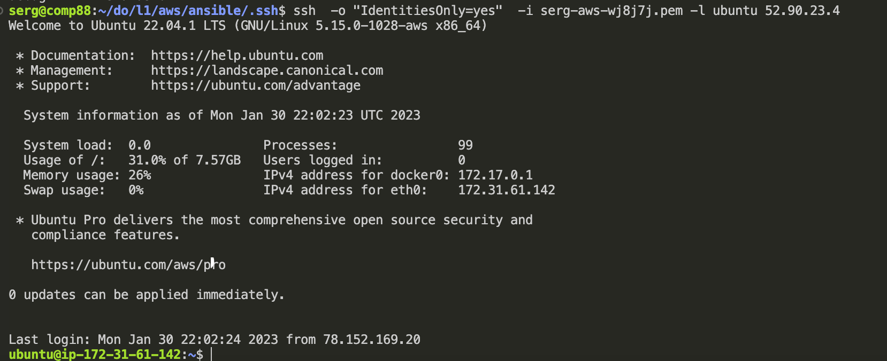

# AWS 
1. Read the terms of Using the AWS Free Tier and the ability to control their own costs.
2. Register with AWS.
3. Review Getting Started with Amazon EC2. Log Into My AWS Account, Launch, Configure, Connect and Terminate My Instance.

Connection to instance.

4. Create a snapshot of your instance to keep as a backup.

5. Create and attach a Disk_D (EBS) to your instance to add more storage space. Create and save some file on Disk_D.
Add storage 

Create files on disk 

6. Launch the second instance from backup

7. Launch and configure a WordPress instance

8. Review the 10-minute Store and Retrieve a File. Repeat, creating your own repository.

9. Review the 10-minute exampleDeploy Docker Containers onAmazon Elastic Container Service (Amazon  ECS). Repeat,  create  a  cluster,  and  run  the  online  demo  applicationor  better  otherapplicationwith custom settings.

10. Run a Serverless "Hello, World!"with AWS Lambda.

11. Create a static website on Amazon S3, publicly available(link1or link2-using a custom domain registered  withRoute  53). Post  on  the  page  your  own  photo,  the  name  of  the  educational program (EPAM Cloud&DevOps  Fundamentals  Autumn  2022),the list  of  AWS  services  with which the student worked within the educational program or earlierand the full list with links of completed labs (based on tutorialsor qwiklabs). Provide the link to the websitein your reportand СV.
[http://serhii.b.s3-website-us-east-1.amazonaws.com/](http://serhii.b.s3-website-us-east-1.amazonaws.com/)
