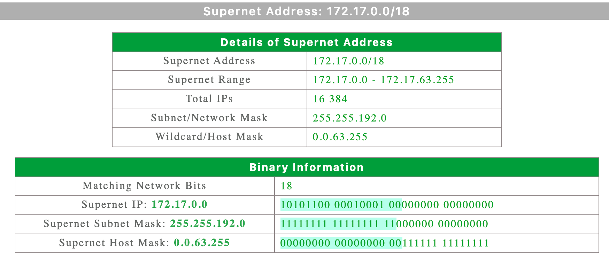
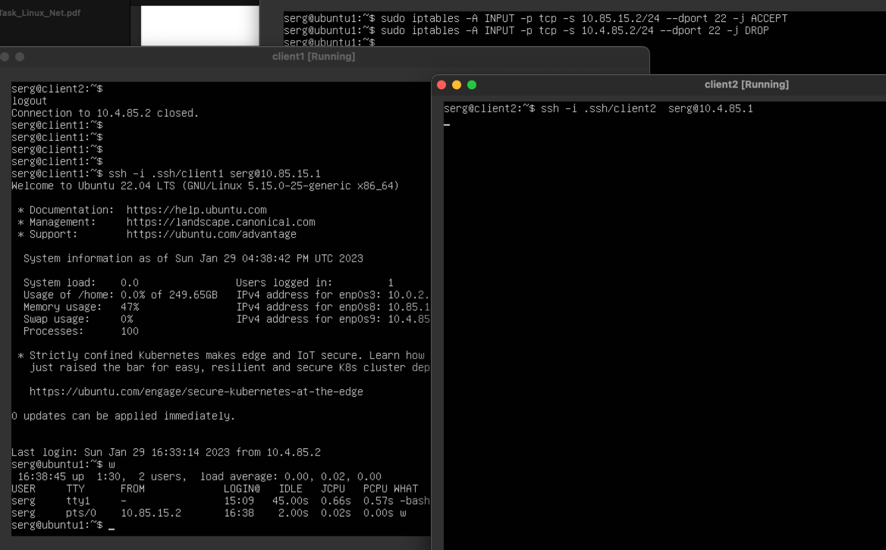

Network architecture 

 

1\. На Server\_1 налаштувати статичні адреси на всіх інтерфейсах

2\. На Server\_1 налаштувати DHCP сервіс, який буде конфігурувати адреси Int1 Client\_1 та Client\_2  

3\. За допомогою команд ping та traceroute перевірити зв'язок між віртуальними машинами

4\. На віртуальному інтерфейсу lo Client\_1 призначити дві ІР адреси за таким правилом: 172.17.25.1/24 та 172.17.35.1/24. Налаштувати маршрутизацію таким чином, щоб трафік з Client\_2 до 172.17.25.1 проходив через Server\_1, а до 172.17.35.1 через Net4. Для перевірки використати traceroute.

Via server1

Via net4

5\. Розрахувати спільну адресу та маску (summarizing) адрес 172.17.D+10.1 та 172.17.D+20.1, при чому префікс має бути максимально можливим. Видалити маршрути, встановлені на попередньому кроці та замінити їх об’єднаним маршрутом, якій має проходити через Server\_1

Summarized net

Delete routes added before

6\. Налаштувати SSH сервіс таким чином, щоб Client\_1 та Client\_2 могли підключатись до Server\_1 та один до одного.

7\. Налаштуйте на Server\_1 firewall таким чином:

*   Дозволено підключатись через SSH з Client\_1 та заборонено з Client\_2

*   З Client\_2 на 172.17.D+10.1 ping проходив, а на 172.17.D+20.1 не проходив

8\. На Server\_1 налаштувати NAT сервіс таким чином, щоб з Client\_1 та Client\_2 проходив ping в мережу Інтернет

