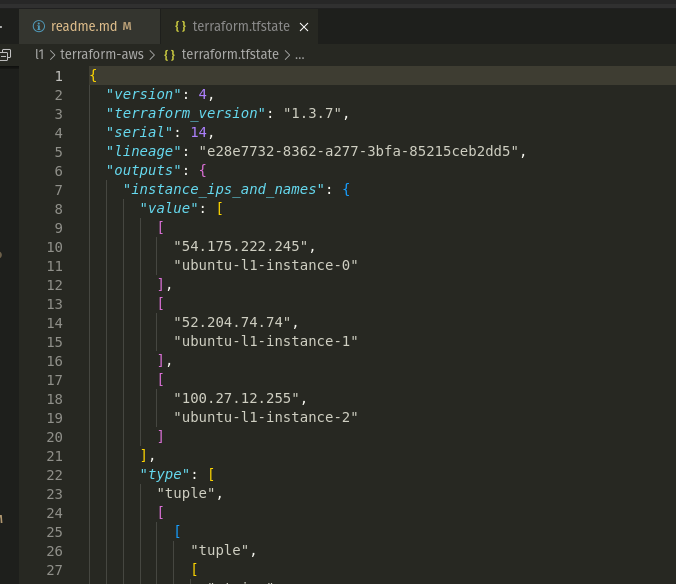
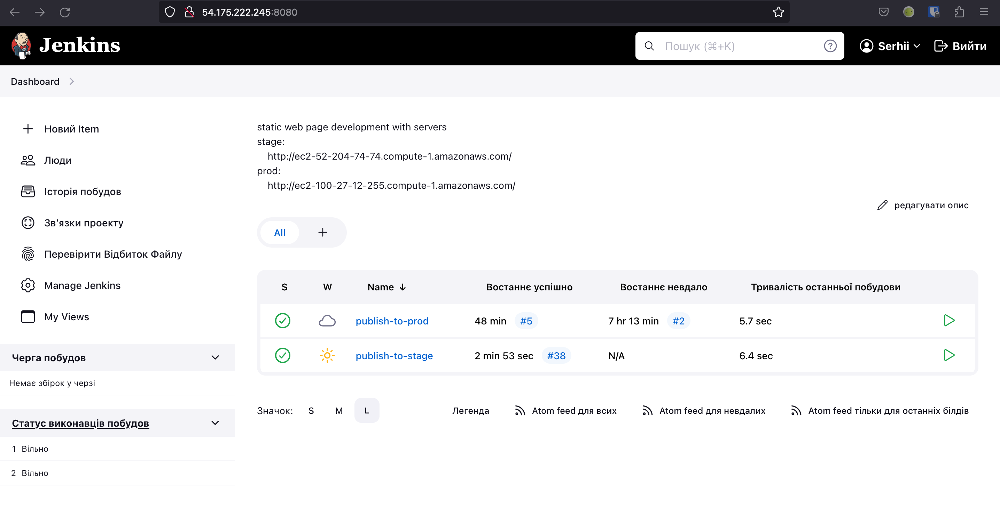
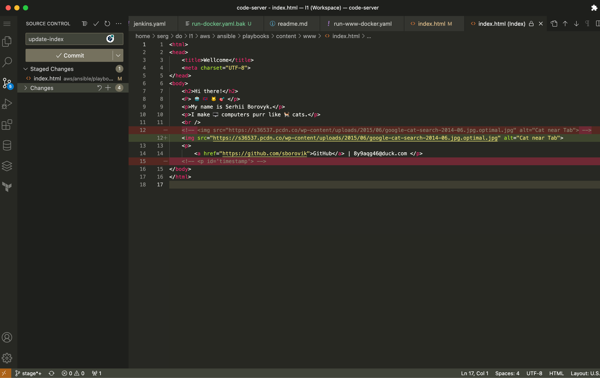
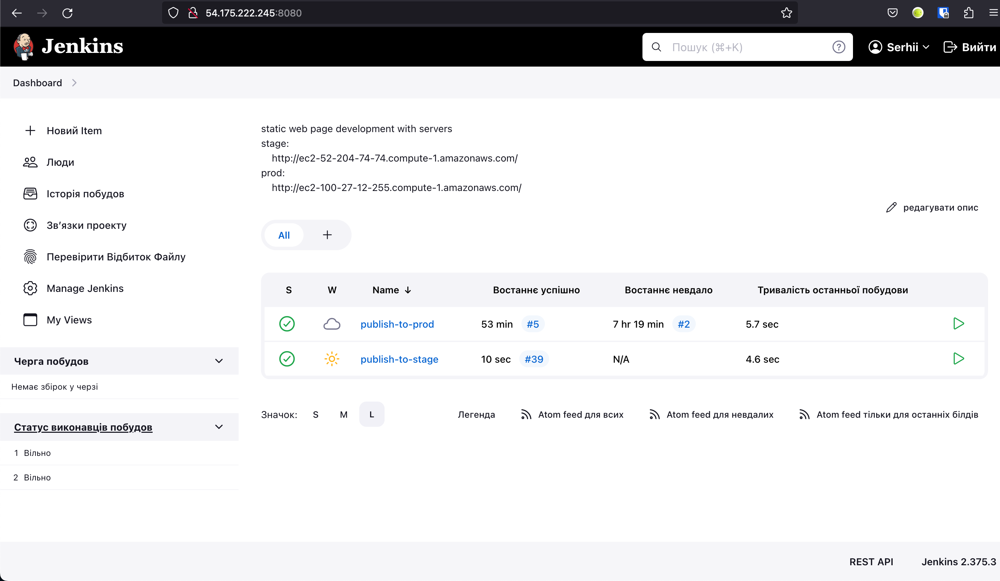
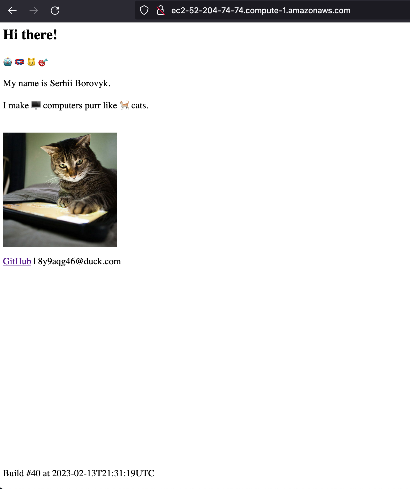
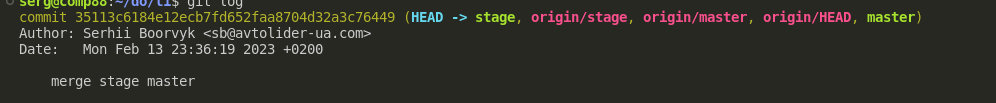
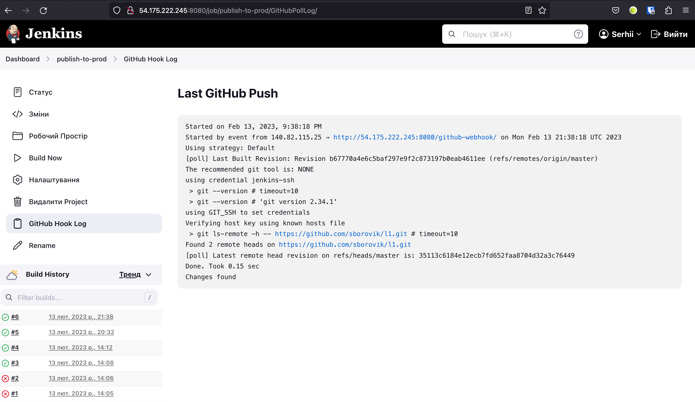
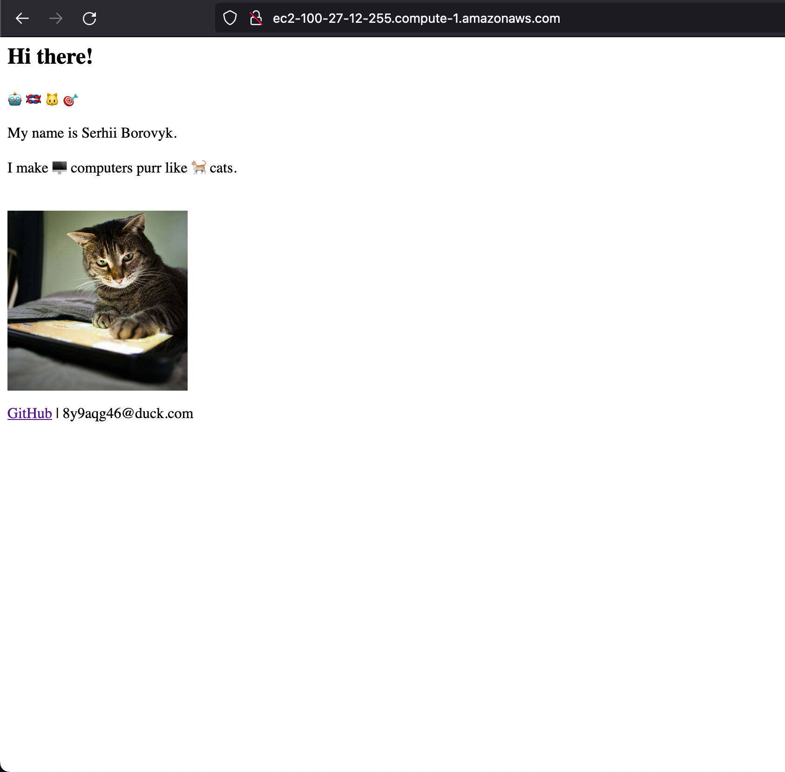

# Final project 
## Personal site develpment 

### Terraform init infrastructure 

### Configure Jenkins for CD 

### Stage server before changes 

### Push changes to stage branch

### Jenkins job after changes 

### Stage server after changes 

### Merge stage branch to master 

### Jenkins job triggered by github webhook

### Results on the prod server

