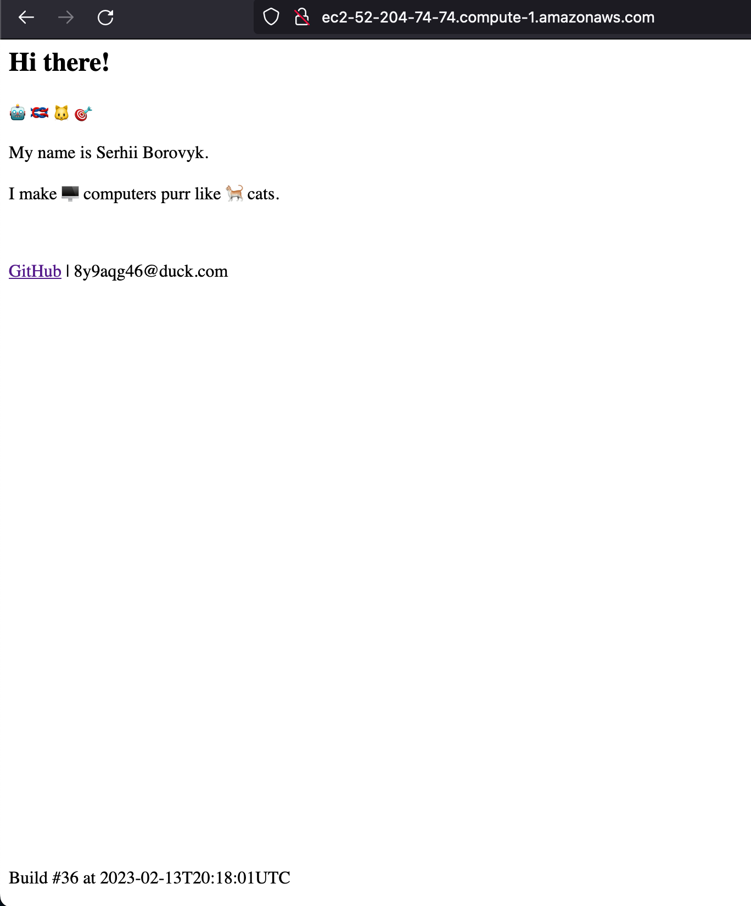

# Final project 
## Personal business card website development CI/CD  

### Presentation 
- [Google slides](https://docs.google.com/presentation/d/e/2PACX-1vQ1CLY_mlVwF7t53XNbO9k4x7KxBu8flZYvmjOckAu1gkwj-MR4qOvb9bs07m2fjE06TbszMheMR5gZ/pub?start=false&loop=false) 
- [pdf](final-project.pdf)

#### Project description

####
- local git, terraform
- AWS cloud [provider](/terraform-aws/provider.tf)
- 3 nodes 
    - [jenkins](/aws/ansible/playbooks/jenkins.yaml), [ansible](/aws/ansible/)
    - [stage](/aws/ansible/hosts)
    - [production](/aws/ansible/hosts)

### Terraform init infrastructure 

### Configure Jenkins for CI/CD 

### Stage server before changes 

### Push changes to stage branch

### Jenkins job after changes 

### Stage server after changes 

### Prod before jenkins deploy

### Merge stage branch to master 

### Jenkins job triggered by github webhook

### Results on the prod server

### Backup at Oracle Cloud Infrastructure
[stage](http://140.238.218.134/)

[prod](http://140.238.218.75/)

